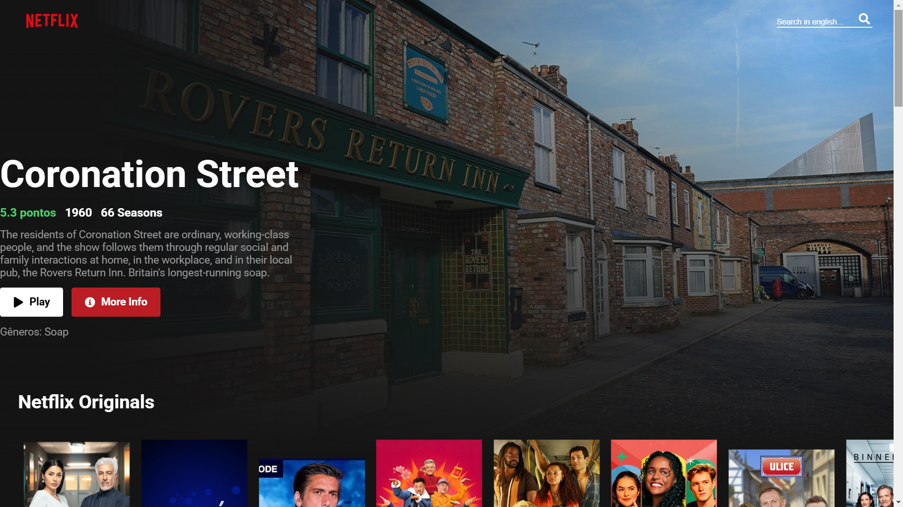

[JAVASCRIPT__BADGE]: https://img.shields.io/badge/JavaScript-F7DF1E?logo=javascript&logoColor=000
[REACT__BADGE]: https://img.shields.io/badge/React-%2320232a.svg?logo=react&logoColor=%2361DAFB
[STYLEDCOMPONENTS__BADGE]:https://img.shields.io/badge/styled--components-DB7093?style=flat&logo=styled-components&logoColor=white
[HTML__BADGE]: https://img.shields.io/badge/HTML-%23E34F26.svg?logo=html5&logoColor=white
[CSS__BADGE]: https://img.shields.io/badge/CSS-1572B6?logo=css3&logoColor=fff
[PROJECT__BADGE]: https://img.shields.io/badge/📱Visit_this_project-000?style=for-the-badge&logo=project
[PROJECT__URL]: https://netflix-app-arthurdias.vercel.app

<h1 align="center" style="font-weight: bold;">NETFLIX APP💻</h1>

![javascript][JAVASCRIPT__BADGE]
![html][HTML__BADGE]
![css][CSS__BADGE]
![react][REACT__BADGE]
![styled components][STYLEDCOMPONENTS__BADGE]

<p align="center">
 <a href="#about">About</a> • 
 <a href="#started">Getting Started</a> • 
  <a href="#started">App Routes</a> 
</p>


<p align="center">
    
</p>

<h2 id="about">📌 About</h2>


This project is a Netflix clone built with React, designed to simulate a streaming platform interface. The goal is to provide an interactive and responsive experience where users can browse movies, view details, and watch trailers. Additionally, it integrates with a movie database API to fetch real-time movie information, providing a dynamic and engaging experience.

[![visit this project][PROJECT__BADGE]][PROJECT__URL]


<h2 id="started">🚀 Getting started</h2>


To run this application on your machine, make sure you have met all the prerequisites and follow the step below after obtaining an API KEY from (https://developer.themoviedb.org/docs/getting-started).

<h3>Prerequisites</h3>


- [NodeJS](https://nodejs.org/en)
- [Git](https://git-scm.com/downloads)
- [API KEY](https://developer.themoviedb.org/docs/getting-started)

<h3>Cloning</h3>

To clone the project, run the code below in your terminal

```bash
git clone https://github.com/ArthurDias26/Netflix-App.git
```

<h3>Starting</h3>

After cloning the application, go to <kbd>src/api/request.js</kbd>, insert your API KEY on line 8, and continue with the steps below.

```bash
cd Netflix-App
npm install
npm start
```

<h2 id="routes">📍 Application Routes</h2>


| route               | description                                          
|----------------------|-----------------------------------------------------
| <kbd>/src/api</kbd>     | Folder containing the file for backend communication with the TMDB API
| <kbd>/src/midia</kbd>     | Folder with the necessary external resources, such as images, fonts, and styles.
| <kbd>/src/components/pages</kbd>     | Folder containing all application pages routed using React Router.
| <kbd>/src/components/layout</kbd>     | Folder with all reusable components used within the pages.
| <kbd>/src/App.js</kbd>     | Main file containing React Router routing and API data import


